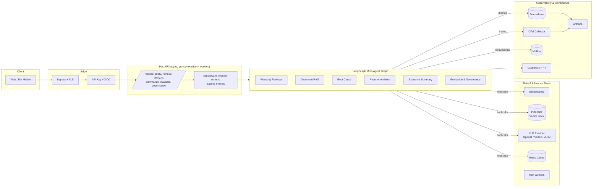
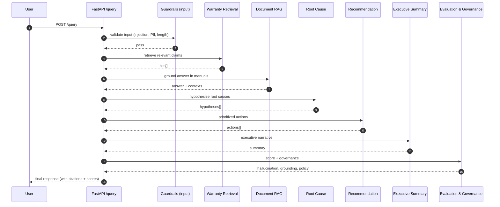
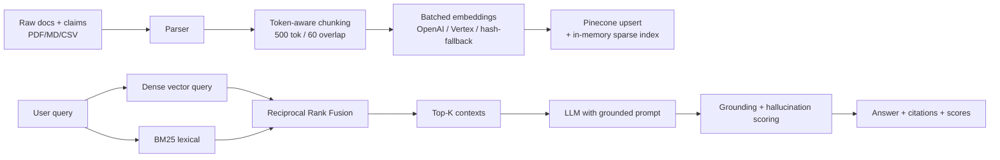

# Warranty Intelligence Agent Platform

> **Enterprise multi-agent AI platform for warranty analytics, root-cause analysis, technical document intelligence, and decision support.**
>
> A Production-grade reference architecture for applied Generative AI in regulated, mission-critical domains. Built with LangGraph, FastAPI, Pinecone, Vertex AI / OpenAI, OpenTelemetry, MLflow, and Kubernetes.

[](.github/workflows/ci.yml)
[](https://www.python.org/)
[](https://fastapi.tiangolo.com)
[](https://langchain-ai.github.io/langgraph/)
[](https://www.pinecone.io/)
[](https://cloud.google.com/vertex-ai)
[](https://prometheus.io/)
[](https://grafana.com/)
[](https://opentelemetry.io/)
[](https://mlflow.org/)
[](https://kubernetes.io/)
[](https://helm.sh/)
[](LICENSE)

---

## Table of contents

1. [Enterprise overview](#1-enterprise-overview)
2. [Business problem](#2-business-problem)
3. [System architecture](#3-system-architecture)
4. [Multi-agent orchestration](#4-multi-agent-orchestration)
5. [RAG pipeline](#5-rag-pipeline)
6. [API surface](#6-api-surface)
7. [Tech stack](#7-tech-stack)
8. [Folder structure](#8-folder-structure)
9. [Setup](#9-setup)
10. [Docker Compose](#10-docker-compose)
11. [Kubernetes deployment](#11-kubernetes-deployment)
12. [CI/CD pipelines](#12-cicd-pipelines)
13. [Observability & evaluation](#13-observability--evaluation)
14. [AI governance](#14-ai-governance)
15. [Benchmarks](#15-benchmarks)
16. [Screenshots & demos](#16-screenshots--demos)
17. [Roadmap](#17-roadmap)
18. [Technical report](#18-technical-report)
19. [References](#19-references)
20. [License](#20-license)

---

## 1. Enterprise overview

The **Warranty Intelligence Agent Platform** is a production-grade reference implementation of an applied Generative AI system for warranty operations in manufacturing / automotive / mobility.

It is **not** a toy chatbot, notebook demo, or RAG tutorial. It is built to look and behave like a system that an applied AI engineering team at a Fortune 500 OEM, financial-services firm (think BlackRock-grade rigor), or industrial-AI startup would actually ship to production:

- Multi-agent orchestration with **LangGraph** (graceful fallback to a sequential async runner)
- Hybrid retrieval (**dense + BM25 + Reciprocal Rank Fusion**) over **Pinecone**
- **Provider-agnostic LLM layer** (OpenAI, Vertex AI Gemini, local vLLM/Triton)
- First-class **observability** (Prometheus, OpenTelemetry, MLflow, structured logs)
- Deterministic **evaluation** (hallucination, grounding, relevancy) wired into CI
- AI **governance** layer with prompt-injection / banned-phrase / PII guardrails
- **Cloud-native** packaging — Docker, Kubernetes, Helm, Terraform (GKE)
- Async, batched **inference engine** with Redis caching and optional Ray fan-out

## 2. Business problem

Warranty programs are expensive (industry average **~2–4% of revenue**), data-intensive, and slow to act on emerging failure trends. Engineering teams need to:

| Pain | Today (manual) | With this platform |
|---|---|---|
| Find similar past claims for a new issue | Hours of BI/SQL | Seconds via semantic + lexical retrieval |
| Identify probable root cause | Tribal knowledge | Grounded multi-agent reasoning over claims, telemetry, manuals |
| Translate field data into exec narrative | Manual decks | LLM-generated, audited, evaluated, citable |
| Recommend actions and prioritize them | Spreadsheet workshops | Structured JSON actions with urgency/effort |
| Trust LLM output in a regulated workflow | Reluctant | Grounding + hallucination scoring on every response, governance reports |

**Outcome**: shorter analysis cycles, earlier defect detection, lower cost-per-claim, and auditable AI usage.

## 3. System architecture



## 4. Multi-agent orchestration

Six specialist agents, composed by a LangGraph `StateGraph`. Each agent is single-responsibility, fully instrumented (metrics + structured logs + retries) and testable in isolation.



| Agent | Purpose | Key tech |
|---|---|---|
| **Warranty Retrieval** | Retrieve relevant claims | Pinecone, hybrid (dense+BM25), metadata filters |
| **Document RAG** | Grounded QA over service manuals | RAG pipeline, citations, grounding score |
| **Root Cause** | Ranked hypotheses with evidence | LLM reasoning, JSON schema enforcement |
| **Recommendation** | Prioritized actions (urgency/effort) | LLM, structured output |
| **Executive Summary** | Business-friendly narrative | Persona-aware prompting |
| **Evaluation & Governance** | Deterministic quality + policy gating | Lexical grounding, regex/Presidio PII |

## 5. RAG pipeline



- **Chunker**: token-aware (`tiktoken`) with character fallback
- **Hybrid retrieval**: dense (Pinecone) + BM25 (in-process) + RRF fusion
- **Grounding**: lexical overlap + per-sentence unsupported detection
- **Provider-agnostic** embeddings + LLM (OpenAI / Vertex / local) with deterministic offline fallbacks for CI

## 6. API surface

OpenAPI is served at `/docs` and `/openapi.json`. All mutating routes require `X-API-Key`.

| Method | Path | Description |
|---|---|---|
| GET  | `/health`              | Liveness probe |
| GET  | `/health/ready`        | Readiness probe (checks vector store, cache) |
| POST | `/query`               | **End-to-end multi-agent workflow** |
| POST | `/retrieve`            | Hybrid retrieval, no generation |
| POST | `/analyze`             | Root cause analysis |
| POST | `/summarize`           | Executive summary across scope/timeframe |
| POST | `/evaluate`            | Score an (answer, contexts) pair |
| POST | `/governance/check`    | Input/output policy check |
| GET  | `/governance/policy`   | Active policy + thresholds |
| GET  | `/trace/recent`        | Recent in-process traces |
| GET  | `/metrics`             | Prometheus metrics |

Example:

```bash
curl -s -X POST http://localhost:8000/query \
  -H "Content-Type: application/json" \
  -H "X-API-Key: dev-local-key-change-me" \
  -d '{
    "query": "Why does the alternator keep failing on Apex S200?",
    "persona": "engineer",
    "top_k": 6
  }' | jq
```

## 7. Tech stack

| Layer | Technology |
|---|---|
| **Orchestration** | LangGraph, LangChain |
| **LLM** | OpenAI, Vertex AI (Gemini), local vLLM/Triton via OpenAI-compatible HTTP |
| **Retrieval / vectors** | Pinecone (prod), FAISS / in-memory (dev), BM25, RRF |
| **Backend** | FastAPI (async), Uvicorn / Gunicorn, Pydantic v2 |
| **Caching / state** | Redis (with in-memory fallback) |
| **Inference** | Custom async batcher, Ray (optional), vLLM/Triton (optional) |
| **Observability** | Prometheus, Grafana, OpenTelemetry, structlog, MLflow, LangSmith-compatible traces |
| **Evaluation / governance** | RAGAS-compatible interface, Presidio PII, regex fallback |
| **Data** | Pandas, PySpark (heavy jobs), Faker (synthetic), pypdf/pdfplumber |
| **Infra** | Docker (multi-stage), docker-compose, Kubernetes, Helm, Terraform (GKE) |
| **CI/CD** | GitHub Actions (test → eval → build → scan → deploy) |
| **Security** | CodeQL, Trivy, Gitleaks, non-root containers, NetworkPolicies, PDB |

## 8. Folder structure

```
warranty-intelligence-agent/
├── app/                          # Application code
│   ├── agents/                   # 6 specialist agents
│   ├── workflows/                # LangGraph orchestration
│   ├── rag/                      # Chunking, retrieval, grounding, pipeline
│   ├── embeddings/               # Embedder + fallback
│   ├── evaluation/               # Deterministic evaluator
│   ├── observability/            # Metrics, tracing, MLflow
│   ├── governance/               # Guardrails, PII
│   ├── inference/                # Batcher, engine, Ray runtime
│   ├── api/                      # FastAPI routes, schemas, middleware
│   ├── services/                 # LLM provider, vector store, cache
│   ├── models/                   # Domain entities
│   ├── prompts/                  # Versioned prompt registry
│   ├── utils/                    # Logging, retry, ids, timing
│   ├── config/                   # pydantic-settings
│   └── main.py
├── infrastructure/
│   ├── docker/                   # Auxiliary images (vLLM/Triton stubs)
│   ├── kubernetes/               # Raw manifests
│   ├── helm/warranty-intel/      # Helm chart
│   ├── monitoring/               # Prometheus, Grafana, OTel
│   └── terraform/                # GKE skeleton
├── data/
│   ├── raw/                      # External datasets (gitignored)
│   ├── processed/                # Output of preprocessing pipelines
│   └── synthetic/                # Generated by scripts/generate_synthetic_data.py
├── scripts/                      # Synthetic data, ingestion, benchmarks
├── notebooks/                    # Exploratory only
├── tests/{unit,integration,evaluation}
├── docs/{architecture,api,reports,datasets,diagrams,screenshots}
├── demos/{gifs,videos}
├── .claude/skills/               # Reusable engineering playbooks
├── .github/{workflows,instructions}
├── Dockerfile  docker-compose.yml  Makefile
├── pyproject.toml  requirements.txt
├── README.md  CLAUDE.md  CODEX.md  OPENCODE.md  COPILOT.md  CHANGELOG.md
└── LICENSE
```

## 9. Setup

```bash
# 1. Clone (you already did this)
cd warranty-intelligence-agent

# 2. Create venv and install
python -m venv .venv
source .venv/bin/activate   # PowerShell: .venv\Scripts\Activate.ps1
make install

# 3. Configure
cp .env.example .env        # PowerShell: Copy-Item .env.example .env
# edit OPENAI_API_KEY / PINECONE_API_KEY (optional for local dev)

# 4. Generate synthetic data + ingest
make data-synth
make ingest

# 5. Run API
make dev                    # http://localhost:8000/docs

# 6. Run tests
make test                   # unit
make test-integration       # API smoke + workflow
make eval                   # quality benchmark
```

The platform runs out-of-the-box **without any API keys** by falling back to:

- in-memory vector store
- deterministic hash-based embeddings
- in-memory cache
- skipped OTel exporter

## 10. Docker Compose

Full local stack (API + Redis + Prometheus + Grafana + OTel Collector + MLflow):

```bash
make docker-up
# API:        http://localhost:8000/docs
# Prometheus: http://localhost:9090
# Grafana:    http://localhost:3000   (admin / admin)
# MLflow:     http://localhost:5000
```

```bash
make docker-down   # tear everything down (+ volumes)
```

## 11. Kubernetes deployment

### Raw manifests

```bash
kubectl apply -f infrastructure/kubernetes/namespace.yaml
kubectl apply -f infrastructure/kubernetes/configmap.yaml
kubectl apply -f infrastructure/kubernetes/secret.example.yaml   # use real secrets in prod!
kubectl apply -f infrastructure/kubernetes/
```

### Helm

```bash
helm upgrade --install warranty-intel infrastructure/helm/warranty-intel \
  --namespace warranty-intel --create-namespace \
  --set image.tag=$(git rev-parse --short HEAD) \
  --set ingress.host=api.warranty-intel.example.com
```

Includes: rolling updates, HPA (CPU+mem), PDB, NetworkPolicy, ServiceMonitor (Prometheus Operator), Workload-Identity-ready ServiceAccount.

## 12. CI/CD pipelines

| Workflow | Triggers | What it does |
|---|---|---|
| `ci.yml` | push, PR | Ruff, Black, mypy, unit tests, AI-quality benchmark (PRs), Docker build, Trivy scan |
| `deploy.yml` | manual | OIDC-auth to GCP, `helm upgrade` against GKE |
| `security.yml` | push, PR, weekly | CodeQL, Trivy filesystem, Gitleaks |

## 13. Observability & evaluation

**Metrics** — custom Prometheus collectors tuned for LLM workloads:

- `warranty_request_duration_seconds{route,outcome}`
- `warranty_llm_token_usage_total{model,kind}`
- `warranty_llm_call_latency_seconds{model}`
- `warranty_agent_latency_seconds{agent}`
- `warranty_retrieval_latency_seconds{index}`
- `warranty_hallucination_score`, `warranty_grounding_score`
- `warranty_governance_blocks_total{reason}`
- `warranty_cache_hits_total{namespace}` / `_misses_total`

**Tracing** — OTel auto-instrumentation for FastAPI + HTTPX; exports to OTLP collector (Tempo / Jaeger / Cloud Trace in production).

**Experiment tracking** — MLflow runs from the evaluation pipeline, tagged with `component=evaluator` and per-prompt versions.

**Evaluation** — `app/evaluation/evaluator.py` produces:

- Hallucination score (1 − lexical grounding)
- Grounding score (token overlap with retrieved contexts)
- Answer relevancy (TF-IDF cosine: question ↔ answer)
- Semantic similarity (TF-IDF cosine: answer ↔ reference) when reference available
- `passed_thresholds` based on configurable governance thresholds

**Dashboard** — `infrastructure/monitoring/grafana/dashboards/warranty-overview.json` ships pre-built panels for RPS, latency percentiles, per-agent latency, LLM token throughput, hallucination distribution, governance blocks, cache hit ratio.

## 14. AI governance

Defense-in-depth across input and output paths:

1. **Input** — length cap, prompt-injection patterns, PII detection (Presidio + regex fallback) → block or redact
2. **Output** — banned phrases, hallucination/grounding threshold check, PII leak detection
3. **Audit** — every governance decision is logged structurally and exported as Prometheus counter `warranty_governance_blocks_total{reason}`
4. **Policy versioning** — `policy_version` field on every `GovernanceReport` for auditability

See `app/governance/` and the [`Governance Standards`](.github/instructions/ai-governance.md) doc.

## 15. Benchmarks

Run the benchmark locally:

```bash
python scripts/eval_benchmark.py
```

Reports p50 / p95 latency and mean grounding / hallucination / relevancy across a curated set of warranty queries. The same script is invoked in CI on pull requests as a regression gate.

| Metric (synthetic baseline) | Target |
|---|---|
| p95 end-to-end latency  | < 6 s |
| Mean grounding score    | ≥ 0.70 |
| Mean hallucination      | ≤ 0.30 |
| Retrieval p95           | < 200 ms |

## 16. Screenshots & demos

Place captures in `docs/screenshots/` and recordings in `demos/gifs/` (kept out of git for size). Suggested captures:

- `docs/screenshots/fastapi_swagger.png` — `/docs`
- `docs/screenshots/grafana_overview.png` — observability dashboard
- `docs/screenshots/agent_trace.png` — OTel trace of a `/query` invocation
- `docs/screenshots/rag_response.png` — answer with citations + scores
- `demos/gifs/query_flow.gif` — terminal recording of `/query`

## 17. Roadmap

- [ ] Reranker (Cohere / cross-encoder) wired into hybrid retriever
- [ ] MCP server exposing the agents as tools to external IDE assistants
- [ ] Cohort analytics agent (claim clustering + drift detection)
- [ ] vLLM auto-scaling on GKE with model warm-pools
- [ ] Feature flag service integration (Unleash / LaunchDarkly)
- [ ] Online RAGAS / DeepEval integration in production traces
- [ ] Vector index backfill jobs as Kubernetes CronJobs / Spark

See [`CHANGELOG.md`](CHANGELOG.md) for what shipped and when.

## 18. Technical report

See **[`docs/reports/technical_report.md`](docs/reports/technical_report.md)**:

*"Enterprise Multi-Agent AI System for Warranty Analytics and Decision Intelligence"* — abstract, methodology, architecture, evaluation, observability, governance, benchmarks, limitations, future work, references.

## 19. References

- **LangGraph** — multi-agent orchestration. https://langchain-ai.github.io/langgraph/
- **LangChain** — building blocks. https://python.langchain.com/
- **Pinecone** — vector database. https://docs.pinecone.io/
- **Vertex AI** — Google Cloud LLMs. https://cloud.google.com/vertex-ai/docs
- **FastAPI** — async Python web framework. https://fastapi.tiangolo.com/
- **OpenTelemetry** — observability standard. https://opentelemetry.io/docs/
- **Prometheus** — metrics. https://prometheus.io/docs/
- **MLflow** — experiment tracking. https://mlflow.org/docs/latest/
- **RAGAS** — RAG evaluation. https://docs.ragas.io/
- **DeepEval** — LLM evaluation. https://docs.confident-ai.com/
- **Presidio** — PII detection. https://microsoft.github.io/presidio/
- **Kubernetes** — orchestration. https://kubernetes.io/docs/
- **MCP** — Model Context Protocol. https://modelcontextprotocol.io/

Selected research:

- Lewis et al., *Retrieval-Augmented Generation for Knowledge-Intensive NLP Tasks*, NeurIPS 2020
- Cormack et al., *Reciprocal Rank Fusion outperforms Condorcet and individual Rank Learning Methods*, SIGIR 2009
- Robertson & Zaragoza, *The Probabilistic Relevance Framework: BM25 and Beyond*, 2009
- Es et al., *RAGAs: Automated Evaluation of Retrieval Augmented Generation*, 2023
- Wang et al., *Survey on Large Language Model based Autonomous Agents*, 2023
- Anthropic, *Constitutional AI: Harmlessness from AI Feedback*, 2022

## 20. License

[MIT](LICENSE).

---

> **Built to demonstrate**: AI Engineering · Agentic AI · MCP · Enterprise RAG · LLMOps · AI Governance · Hallucination Detection · Evaluation Pipelines · Observability · Inference Pipelines · Cloud-native AI · Production-grade AI Systems.
