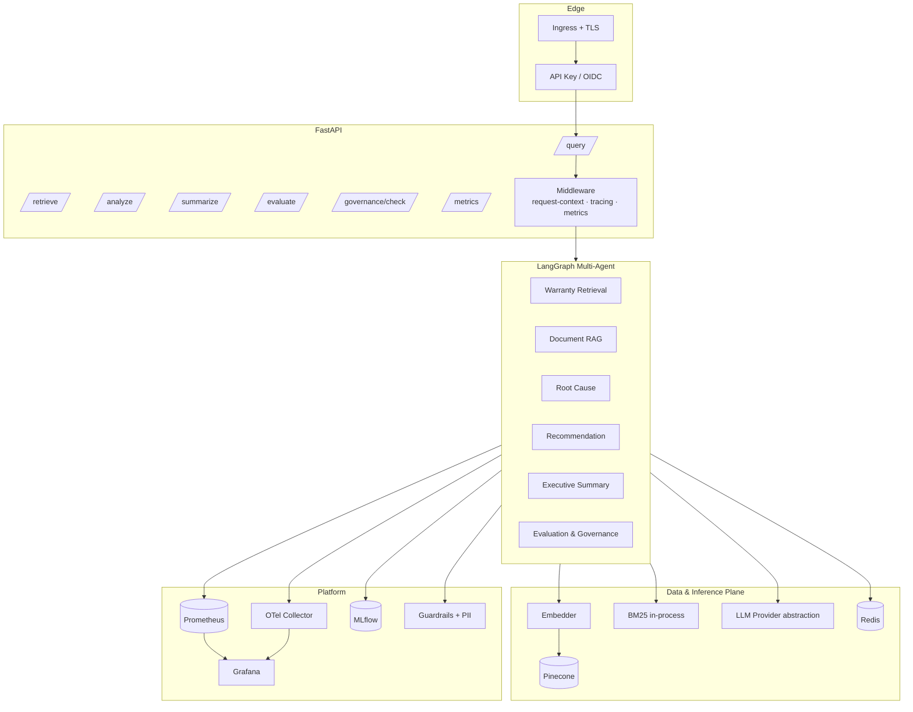

# System Architecture

## High-level



## Module map

| Path                              | Purpose                                    |
|-----------------------------------|--------------------------------------------|
| `app/api/`                        | HTTP routes, schemas, middleware           |
| `app/workflows/`                  | LangGraph orchestration                    |
| `app/agents/`                     | Specialist agents                          |
| `app/rag/`                        | Chunking, retrieval, grounding, pipeline   |
| `app/embeddings/`                 | Provider-backed embedder + hash fallback   |
| `app/services/llm_provider.py`    | LLM abstraction (OpenAI / Vertex / local)  |
| `app/services/vector_store.py`    | Pinecone + in-memory fallback              |
| `app/services/cache.py`           | Redis + in-memory fallback                 |
| `app/inference/`                  | Batcher, engine, Ray runtime               |
| `app/governance/`                 | Guardrails + PII                           |
| `app/evaluation/`                 | Deterministic evaluator                    |
| `app/observability/`              | Metrics, tracing, MLflow                   |
| `app/prompts/registry.py`         | Versioned prompt templates                 |
| `app/config/settings.py`          | pydantic-settings runtime config           |

## Dataflow — `/query`

1. Request enters via Ingress + API-key validation.
2. `RequestContextMiddleware` binds a `request_id` to structlog context vars and records duration.
3. `Guardrails.check_input` evaluates the prompt (length, injection, PII).
4. `WarrantyGraph.run` enters LangGraph (or sequential fallback) and executes 6 agents in order.
5. Each agent emits Prometheus metrics, OTel spans, and structured logs.
6. The evaluation agent scores the final answer (hallucination / grounding) and the guardrails check the output.
7. Response is assembled with citations, evaluation metrics, governance report, and trace metadata.

## Deployment topology

```
Cloud LB
   │
Ingress (nginx) ── TLS via cert-manager
   │
Service ClusterIP
   │
Deployment (3..20 replicas, HPA 65% CPU)
   │
Pods:
  - warranty-api (read-only FS, non-root)
  - sidecars: none (we keep it minimal)
Volumes:
  - emptyDir: /tmp, /home/app/.cache
Dependencies:
  - Pinecone (external SaaS)
  - Redis (in-cluster StatefulSet)
  - OTel Collector (DaemonSet or central deployment)
  - MLflow (separate Deployment + PVC)
  - Prometheus + Grafana (kube-prometheus-stack)
```
